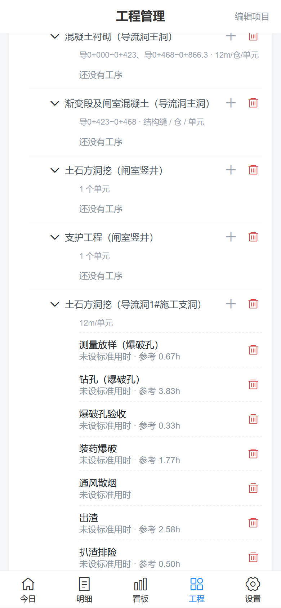
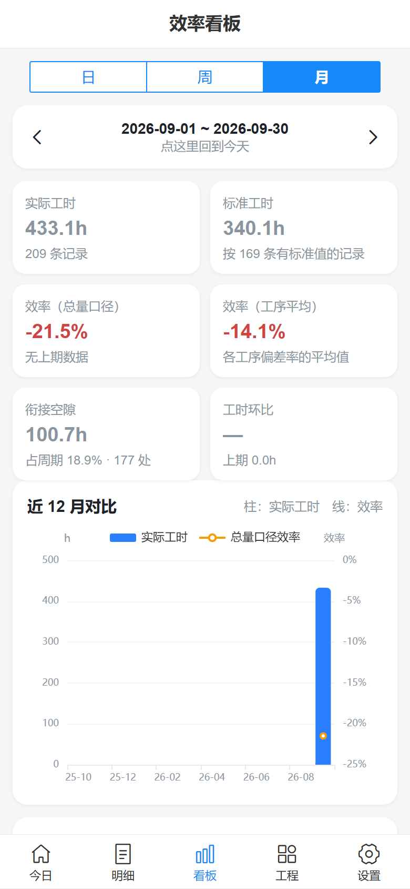
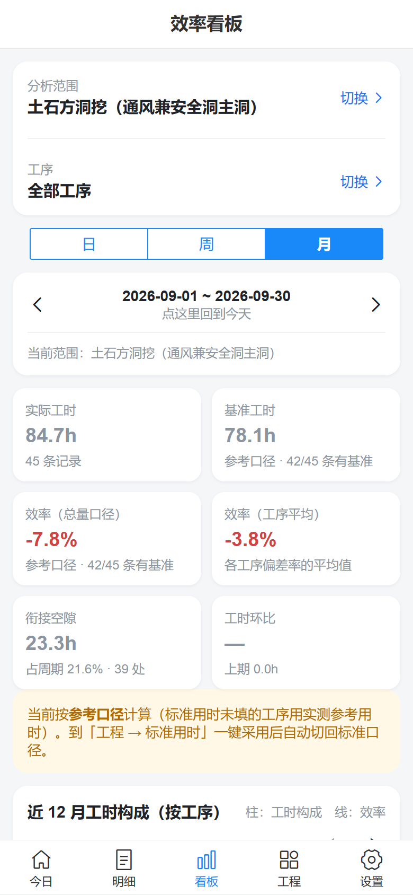
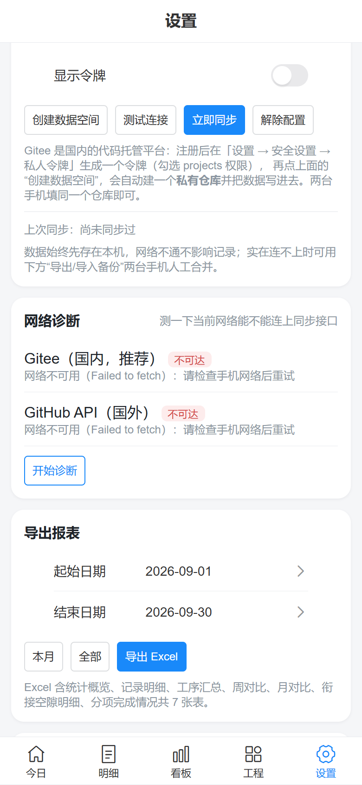

# 工序用时记录与效率分析（滚哈导流洞 · 和静抽蓄通风兼安全洞及进厂交通洞工程）

给现场施工员用的工序计时与效率分析工具：记录每道工序的开工/完工时刻，自动算用时与**工序衔接空隙**，并给出**日 / 周 / 月**对比与效率百分比，用于发现"哪道工序耗时最多""哪个环节空档最长"。

内置模板按本标段《项目划分申报表（DL-BS（2025）010号）》建立：**10 个单位工程**、全部分部工程与单元（分项）工程；
**导流洞 1#施工支洞、通风兼安全洞主洞、导流洞闸室交通洞** 三个工作面配了循环作业工序，
并把 2026 年 9 月已记录的 **209 条**循环作业数据补录进系统作为参考。

- 形态：纯静态手机网页（PWA），微信里可直接打开，也可"添加到主屏幕"当 App 用
- 数据：**先存手机本地**（离线照常记录），联网后与私有 GitHub Gist 双向合并
- 无需服务器、无需域名备案、无需任何 API Key
- 两人错班使用：各记各的，同步后自动合并，绝不互相覆盖

| 今日记录 | 工程结构（工序 + 参考用时） | 标准用时（一键采用） | 效率看板 |
| --- | --- | --- | --- |
|  |  |  |  |

| 看板（选定某个分项工程） | 明细（按范围筛选） |
| --- | --- |
|  |  |

> 2026-09-16 ~ 09-30 三份循环作业数据（209 条）补录后的实际统计：实际工时 409.1h、
> 衔接空隙 99.3h（占 19.5%）、责任原因前三位为欠挖/补炮返工 8.9h、等炸药 8.7h、等喷浆料 5.3h。
> （2026-10-01 按修正后的 1#施工支洞 9.26 记录重算：单个工序不再有超过 12 小时的异常值。）

## 一、功能

**① 现场记录（≤3 次点击一条）**
- 选工序（单位工程 → 分部 → 分项 → 工序 四级级联）→ 填开工、完工时刻 → 保存
- 完工时刻早于开工时刻时自动判定为**跨零点**（夜班 20:00–04:00 = 8 小时）
- 可填完成工程量、部位/桩号、备注，以及**开工前等待的原因**（等材料 / 等机械 / 等验收 / 等图纸 / 天气 / 交叉作业 / 人员不足 / 返工 / 交接班 …）
- 同一天同一工序可以录多条
- 首页按"分部 / 分项"分组显示当天记录，并提供"近两周常用工序"一键补录

**② 效率看板（日 / 周 / 月）**
- 实际工时、标准工时、衔接空隙（含占周期比例）
- **效率双口径**：总量口径 = Σ基准用时 ÷ Σ实际用时 − 1；工序平均口径 = 各工序（基准 − 实际）÷ 基准 的平均
- 环比：本期 vs 上一期（工时环比、效率变化百分点）
- 近 14 天 / 近 12 周 / 近 12 月 **堆叠柱状趋势**（整体时按工作面分层，选定分项时按工序分层）+ 效率线；
  选定分项及以下时画 24h 参考线，单日超 24h 会标红提示核对是否有重复记录
- **工序用时排行**：整体视图下每条都带"所属分项工程"（两行标签），不会再分不清是哪个部位的钻孔
- **用时占比饼图**：整体时按分项工程分扇区（一眼看出哪个工作面占大头），选定分项时按工序分扇区
- 衔接空隙排行（带分项工程前缀）、空隙原因分布（饼图）
- 日历热力图（当月每日工时）、分项工程完成量与完成百分比

**分析范围**：页首可切换「全部工程 / 单位工程 / 分项工程」，选定分项后还能再筛到单道工序；**所有图表都按选定范围重算**，
所以能单独看"1#支洞开挖""通风洞支护"这类工作面的效率、用时与衔接，而不是被迫看全项目合计（全项目一天会超过 24h，因为多条洞是并行施工的）。

**效率基准口径**：每条记录的基准 = `标准用时 ?? 实测参考用时`。全用标准时标注"标准口径"；
有用到参考值时标注"参考口径（N/M 条有基准）"——不填标准用时也能看到效率曲线，填好后自动切回标准口径。

**③ 工程管理**
- 四级结构自由增删改：单位工程 / 分部工程 / 分项工程 / 工序
- 一键套用**水利通用工序模板**（土石方开挖、混凝土、灌浆、锚固支护、金属结构与机电、导流、施工道路…）
- 批次编辑"标准用时"，可一键采用历史平均作为建议值
- 多项目并行，支持归档

**④ 数据与报表**
- 导出 Excel：统计概览 / 记录明细 / 工序汇总 / 周对比 / 月对比 / 衔接空隙明细 / 分项完成情况（7 张表）
- 导出 JSON 备份、导入备份合并（导入前自动留可回滚快照）
- 记录明细页同样带**分析范围筛选**（与看板共用选择），顶部统计跟随筛选结果；从看板"查看记录明细"进入时会带上当前月份

## 二、计算规则

| 指标 | 规则 |
| --- | --- |
| 工序用时 | 完工时刻 − 开工时刻；完工 ≤ 开工时按跨零点 +1 天 |
| 衔接空隙 | 同一分项工程内（本标段一个分项工程就是一个工作面）按开工时间排序后，**后一条开工 − 前一条完工**；重叠记 0；间隔超过 **6 小时**视为夜班停工，不计入；部位/桩号只用于显示 |
| 效率（总量口径） | Σ标准用时 ÷ Σ实际用时 − 1，正数=比标准快 |
| 效率（工序平均） | 各工序（标准用时 − 实际用时）÷ 标准用时 的算术平均 |
| 完成百分比 | Σ已完成工程量 ÷ 分项工程的设计总量 |
| 工时环比 | 本期实际工时 ÷ 上一期 − 1 |

> 衔接空隙的"原因"记在**后一道工序**那条记录上，表示"这道工序开工前在等什么"，这样空档与原因天然配对。
>
> **参考用时**：三份循环作业记录实测出来的中位数，只作参考、**不参与效率计算**；样本少于 5 次的工序不给参考值。
> 标准用时留空时效率显示"—"，可在「工程 → 标准用时」一键采用参考用时。

## 三、本地运行

```bash
pnpm install
pnpm dev          # 开发预览
pnpm test         # 单元测试（26 项：用时、跨零点、空隙、双口径效率、合并冲突…）
pnpm build        # 类型检查 + 生产构建，产物在 dist/
pnpm preview      # 预览 dist
```

## 四、部署到 GitHub Pages（推荐）

产物是纯静态文件，`https://<用户名>.github.io/<仓库名>/` 这种子路径可以直接跑（资源已是相对路径、路由用 `#/`）。

1. 在本目录初始化 git 并推送到 GitHub 仓库（建议仓库名 `gongxu-tracker`）：

   ```bash
   git init -b main
   git add .
   git commit -m "工序用时记录与效率分析"
   git remote add origin https://github.com/<用户名>/gongxu-tracker.git
   git push -u origin main
   ```

2. 仓库 **Settings → Pages → Build and deployment → Source** 选 **GitHub Actions**。
3. 推送后 `.github/workflows/deploy-pages.yml` 会自动跑"安装 → 单测 → 构建 → 发布"，几分钟后访问
   `https://<用户名>.github.io/gongxu-tracker/`，手机浏览器打开 → 分享 → **添加到主屏幕**。

> 注意：GitHub 免费版 Pages **只支持公开仓库**。本项目的源码、内置模板与 209 条历史记录都会随之公开
>（本项目已确认可以公开）。若以后需要私有，改用 Netlify（私有仓库免费，`netlify.toml` 已备好）或 GitHub Pro。

> 微信里直接打开链接也能正常使用；但"添加到主屏幕 + 离线打开"体验最好用系统浏览器（Safari / Chrome）。

## 五、配置两台手机的数据同步（Gitee 私有仓库）

同步后端可在 **设置 → 数据同步** 里切换：**Gitee（国内推荐）** 或 **GitHub Gist**。推荐 Gitee，因为 `gitee.com` 国内直连，
而 `api.github.com` 在大陆经常连不上（`github.io` 能打开不代表 API 能通，两者是不同域名）。

1. 注册 Gitee（码云）→ **设置 → 安全设置 → 私人令牌** → 新建令牌，勾选 **projects** 权限，复制令牌。
2. App 的 **设置 → 数据同步** 选 **Gitee（国内推荐）**，粘贴令牌 → 点 **创建数据空间**
   （会自动建一个**私有仓库** `gongxu-data`，并把 `data/meta.json`、`data/catalog.json` 写进去）。
   若已有仓库，直接填 `用户名/仓库名`，数据目录默认 `data`。
3. 在第二台手机上填**同一个令牌与仓库**即可。
4. 之后每次打开、每次保存记录都会自动同步；也可手动点"立即同步"。

> **第二台手机怎么开始**：点首页的"一键建立本标段项目"（用的是**固定项目 id**，两台手机生成的结构与历史记录 id 完全相同），
> 再填同一个 Gitee 仓库同步即可——合并时按 id 去重，**不会出现两份项目或两份记录**。
> 若第二台手机先做了同步，项目会直接从云端拉下来，点按钮会提示"已存在并切换过去"。

### 同步常见问题

| 现象 | 原因与处理 |
| --- | --- |
| `Gitee 同步：数据空间不存在或无权访问（404）` | "数据仓库"填得和 Gitee 上的地址不一致。必须是 **用户名/仓库名** 且连字符一致，例如 `youzero/gongxu-data`（写成 `gongxudata` 就会 404）。提示里会回显你当前填的值。 |
| 点"创建数据空间"报 `422 已存在同地址仓库` | 仓库已经建过（第二台手机走同样流程时必然如此）。现在的版本会**自动复用已有仓库**并回填正确名字，且**不会覆盖云端已有数据**；只有旧版本才会弹这个错。 |
| 记录人里出现多个"白班" | 每台手机首次打开都会自动建一个默认记录人。各自改成自己的名字/班次，多余的用右侧垃圾桶删掉即可（删除会同步）。 |

**先测一下网络**：设置页有 **网络诊断**，会分别探测 Gitee 与 GitHub 接口的连通性和耗时，
建议在工地的手机上点一次，哪个能连就用哪个（沙箱/无外网环境下两个都会显示不可达，属正常）。

| 数据同步（默认 Gitee） | 网络诊断 |
| --- | --- |
|  |  |

**同步逻辑（为什么不冲突）**

1. 拉取云端数据；
2. 与本地数据**按每条记录的 id + updatedAt 逐条取新**合并（删除用软删除标记，时间戳相同时删除优先，记录不会被"复活"）；
3. 只把有变化的月份推回云端；
4. 再回拉校验一次，若发现被另一台设备覆盖，则自动再合并推送一轮。

记录按月分片存放（`records-YYYY-MM.json`，Gitee 下位于 `data/` 目录），单文件接近 1MB 时会提示归档——
这是为了避开"接口单文件超 1MB 会被截断"的硬限制（GitHub Gist 与 Gitee 内容接口都有此限制）。

## 六、目录结构

```text
src/
  core/       计算引擎：用时、衔接空隙、双口径效率、趋势、完成率（纯函数，有单元测试）
  db/         Dexie/IndexedDB 数据层 + 本标段项目划分模板 + 历史记录数据
  sync/       GitHub Gist 分片同步与合并规则
  store/      全局状态（当前项目、当前记录人、同步状态）
  views/      首页 / 记录 / 明细 / 看板 / 工程 / 设置
  utils/      自研极简 XLSX 导出、备份文件读写
scripts/
  parse_loop_logs.py   把「循环作业」Word 日志解析成结构化记录与实测统计（数据准备工具）
docs/         截图
tests/        单元测试
```

### 重新解析循环作业日志

日志目录：`C:\Users\Administrator\Desktop\循环作业记录工时\`（三份 .docx）。

```bash
python scripts/parse_loop_logs.py     # 重新生成 src/db/data/loop-history.json
pnpm test                             # 校验条数与参考用时
pnpm build                            # 重新打包
```

解析规则：全角/半角冒号与波浪线归一；日期标题（9.17 / 9月21 / 2026.09.19）归属其后时间段；
跨零点与 `24:15` 这类写法自动并入次日；等待/故障类时间段不生成记录，而是写成**下一条工序的开工前等待原因**；
单道工序超过 12 小时或不足 5 分钟标记为异常（保留记录但不参与参考用时统计）。

每次解析还会输出人工复核清单 `docs/循环作业解析复核清单.csv`（工作面 / 日期 / 起止 / 用时 / 归类工序 / 等待原因 / 原文 / 是否需复核），
共 209 行，其中 63 行标了"需复核"（2 行时长异常、61 行归类建议复核：验收类与测量类容易混）。

## 七、已知限制与风险

- **GitHub 在国内访问可能不稳定**：数据永远先存本机，网络不通不影响记录；同步失败会有明确提示（15 秒超时）。实在连不上时，用"导出 JSON 备份 → 微信发给对方 → 导入备份合并"即可人工合并。
- **微信内置浏览器对离线网页支持有限**：建议把"系统浏览器 + 添加到主屏幕"作为主入口。
- 效率百分比依赖"标准用时"的准确性：没填标准值的工序不计入效率，只计入实际工时。
- 单月数据超过约 900KB 时会拒绝上传并提示归档（正常情况下两人一年也到不了）。

## 八、许可

本项目代码可自由使用与修改。第三方依赖许可：Vue / Vant / Dexie / Vue Router（MIT）、ECharts（Apache-2.0）。
